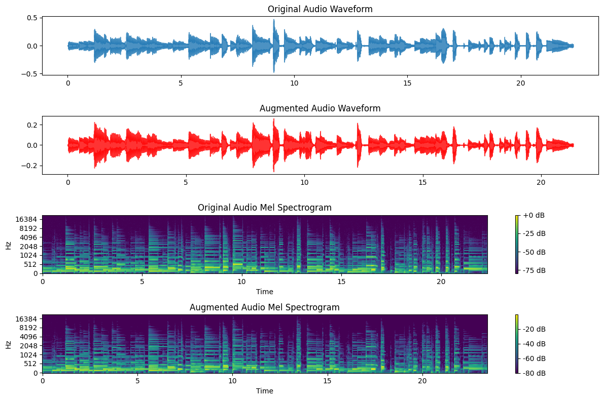

# Data-Augmentation-to-help-with-Guitar-String-Separation

This repository contains the code for my dissertation on using data augmentation to improve guitar string separation with deep learning.

### Overview

Accurate detection and separation of individual guitar strings from an audio signal is a challenging task due to complex guitar acoustics and lack of diverse training data. This dissertation explores the application of data augmentation techniques to improve guitar string separation using a U-Net model.
The main techniques investigated are:
- Time Stretching
- Pitch Shifting
- Noise Injection

The aim is to enhance model robustness, improve generalization, and increase separation accuracy by augmenting the training data.

### Repository Files
The repository contains the following key components
- Model Train and Evaluation Notebook [Guitar String Separation](https://github.com/change0z/Data-Augmentation-to-help-with-Guitar-String-Separation/blob/main/GSS.ipynb)
- Exploratory Analysis for each channel of the Ground Truth Library to understand the musical componets - [Exploratory Analysis](https://github.com/change0z/Data-Augmentation-to-help-with-Guitar-String-Separation/blob/main/Exploratory_Analysis.ipynb)
- Notebook to perform Data Augmentation Techinques and create Augmented Datasets - [Data Augmentation](https://github.com/change0z/Data-Augmentation-to-help-with-Guitar-String-Separation/blob/main/Data_Augmentation_Dataset_Creation.ipynb)

### Requirements
- Python 3.6+
- Pytorch 1.0+
- Other common packages lusted in [requirements.txt](https://github.com/change0z/Data-Augmentation-to-help-with-Guitar-String-Separation/blob/main/requirements.txt)

## Details About the Augmentation Techniques.

### Time Stretching

The dissertation implements time stretching by first separating the audio into harmonic and percussive components using harmonic-percussive source separation (HPSS). The harmonic and percussive parts are then time stretched independently using librosa's time_stretch function. This applies a phase vocoder technique to stretch the signals between 0.9 and 1.1 times their original length, selected randomly per sample. The time-modified harmonic and percussive components are recombined to produce the final time-stretched audio.

Separating the components avoids undesirable artifacts and maintains transient quality. Stretching between 0.9-1.1x introduces realistic variations in tempo.

